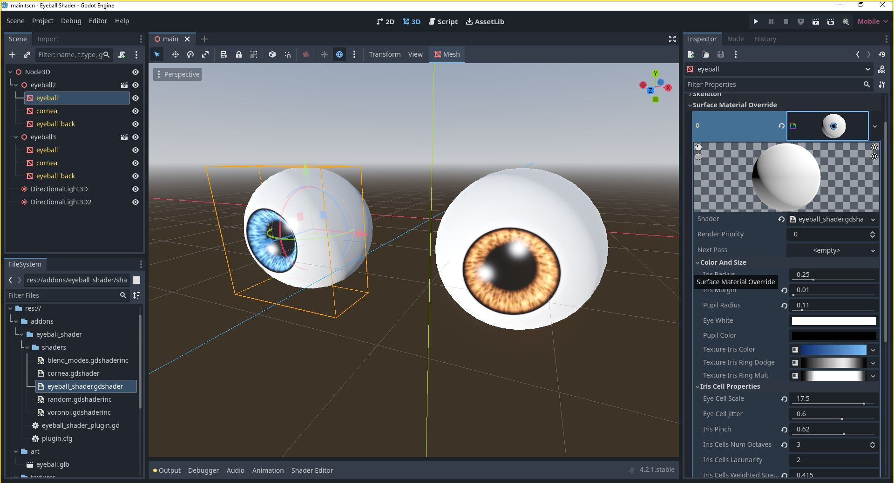
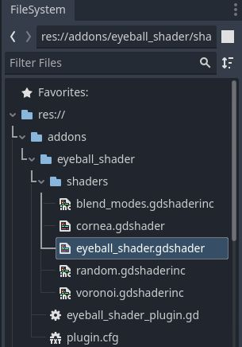
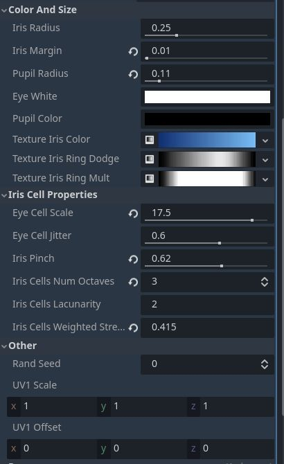

# Eyeball Shader

This project contains shaders for rendering eyeballs.  The `eyeball_shader.tres` can be used to draw the eyeball itself and the `cornea.gdshader` can be used to create a glassy effect for the cornea of the eye.

## Installation

Download the zip file from the releases and add everything in the `addons/eyeball` shader to your project.  Make sure to keep the same project structure as is in the zip file.

## Usage

Create a new ShaderMaterial and assign the `eyeball_shader.gdshader` shader to it.  (Or the `cornea.gdshader` if you're shading the cornea).  You can then adjust the shader's properties to alter the effect of the shader.

### Properties

#### Color and Size
* Iris Radius - Radius of the iris
* Iris Margin - The width of the black line between the outer edge of the iris and the white of the eye
* Pupil Radius - Radius of the pupil
* Eye White - Color of the white part of the eye
* Pupil Color - Color of the pupil of the eye
* Texture Iris Color - A gradient for coloring the cells of the iris.  The left of the gradient colors the center of the cells and the right of the gradient colors the edges of the cells.
* Texture Iris Ring Dodge - Adds a highlight to the iris.  This gradient is laid out in a ring between the pupil and the sclera and combined with the iris using a color dodge overlay operation.
* Texture Iris Ring Mult - Darkens parts of the iris.  This gradient is laid out in a ring between the pupil and the sclera and combined with the iris using a multiply overlay operation.

#### Iris Cell Properties

* Eye Cell Scale - Size of the largest cells in the iris
* Eye Cell Jitter - the randomness of the offsets between cells.
* Iris Pinch - Elongates the cells toward the center of the eye.
* Iris Cells Num Octaves - Lets you define the number of layers of cells that are mixed together.  For each extra layer, a shrunken and lightened copy is combined with the layer below it, creating a more naturalistic effect.
* Iris Cells Lacunarity - How much to shrink each additional layer.
* Iric Cells Weighted Strength - How much to lighten each additional layer of cells.

#### Other

* Rand Seed - Random seed for randomizing the pattern of cells
* UV1 Scale - Scale the UVs of the base mesh
* UV1 Offset - Offset the UVs of the base mesh

## Support

If you found this software useful, please consider buying me a coffee on Kofi.  Every contribution helps me to make more software:

